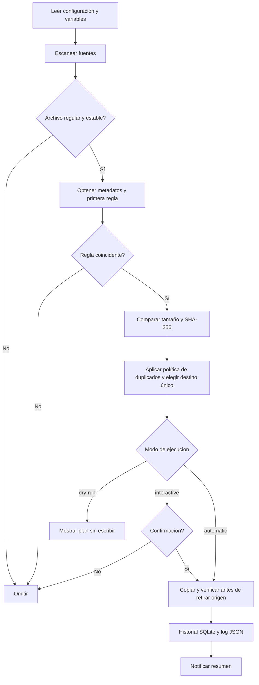

# SmartFileOrganizer

Organizador de archivos en Python 3.11+ con reglas YAML/JSON, detección de duplicados por tamaño y SHA-256, historial SQLite y automatización desde la terminal.

El comando predeterminado muestra un plan. Los movimientos requieren `--mode interactive`, `--mode automatic` o `--apply` en los procesos de programación y observación.

## Instalación y primeros pasos

```bash
git clone https://github.com/DeepAutomation-AI/SmartFileOrganizer.git
cd SmartFileOrganizer
python3 -m venv .venv
uv sync --locked --extra dev
cp .env.example .env
```

Edita [config/default.yaml](config/default.yaml) para seleccionar las carpetas de origen y `destination_root`. Las rutas relativas se resuelven desde la carpeta del archivo de configuración; `${HOME}` y `~` permiten usar la carpeta personal.

La instalación reproducible usa [uv.lock](uv.lock) y requiere `uv`. `uv sync --locked` comprueba que el lock corresponde a `pyproject.toml` e instala las versiones registradas sin actualizarlo. Si prefieres pip, usa `.venv/bin/python -m pip install -e '.[dev]'`; esa alternativa instala según los rangos compatibles del proyecto.

```bash
# Comprueba el esquema y muestra las rutas efectivas.
.venv/bin/smartfileorganizer --config config/default.yaml validate

# Presenta las decisiones sin mover archivos ni crear DB, logs o destinos.
.venv/bin/smartfileorganizer --config config/default.yaml organize

# Solicita confirmación para cada movimiento; la respuesta predeterminada es no.
.venv/bin/smartfileorganizer --config config/default.yaml organize --mode interactive

# Ejecuta las mismas reglas sin preguntas.
.venv/bin/smartfileorganizer --config config/default.yaml organize --mode automatic

# Consulta las últimas operaciones reales.
.venv/bin/smartfileorganizer --config config/default.yaml history --limit 20
```

En Windows, usa `.venv\Scripts\python.exe` y `.venv\Scripts\smartfileorganizer.exe`. Los comandos con Make están orientados a Linux/macOS.

```bash
make sync       # instalación con uv.lock
make validate
make dry-run
make run        # modo interactivo
make test       # pytest; exige al menos 81% de cobertura
make lint
```

`CONFIG`, `ENV_FILE`, `VENV`, `PYTHON` y `UV` son configurables: `make dry-run CONFIG=/ruta/reglas.yaml`. `make install` ofrece la alternativa con pip.

## Qué organiza

- Escaneo recursivo o de un solo nivel, configurable por carpeta; exclusiones mediante patrones glob.
- Clasificación por extensión, MIME, palabras clave, tamaño y antigüedad de creación/modificación.
- Primera regla coincidente, con condiciones combinadas mediante AND y listas de alternativas mediante OR.
- Duplicados por tamaño y SHA-256: omitir, mover a una carpeta de duplicados o conservar ambas copias con nombres distintos.
- Modos `dry-run`, `interactive` y `automatic`; archivos recientes, inestables y enlaces simbólicos se omiten.
- Destinos limitados a la raíz elegida, sin sobrescritura; errores por archivo se registran y el procesamiento continúa.
- Registro JSON con rotación, configuración efectiva e historial de operaciones en SQLite.
- APScheduler, cron/systemd y observación opcional con watchdog.
- Notificaciones opcionales de escritorio, SMTP con TLS y Telegram.

El MIME se infiere mediante `mimetypes` a partir del nombre: un archivo renombrado no se identifica por su contenido. La fecha de creación usa `st_birthtime` cuando existe; en otros sistemas se utiliza la modificación, nunca `ctime` como fecha de nacimiento. Las plantillas de fechas utilizan la modificación en UTC.

## Reglas

Este ejemplo conserva el orden de prioridad: primero archivos antiguos, después imágenes grandes y después PDF.

```yaml
sources:
  - path: "${HOME}/Downloads"
    recursive: true
destination_root: "${HOME}/Organized"
database: "../.state/history.sqlite3"
log_file: "../.logs/organizer.jsonl"
duplicate_policy: skip
duplicate_directory: Duplicates
exclude: ["*.part", "*.crdownload", "*.tmp"]
min_file_age_seconds: 2
notifications:
  channels: []
schedule:
  interval_seconds: 300
  timezone: UTC
rules:
  - name: Archivar antiguos
    match: {older_than_days: 90}
    destination: "Archive/{year}"
  - name: Imágenes grandes
    match: {mime: ["image/*"], min_size: 5242880}
    destination: Photos/Large
  - name: PDF
    match: {extensions: [pdf]}
    destination: "Documents/PDFs/{año}"
```

Un archivo sin una regla coincidente permanece en su origen. Añade `match: {}` al final para recoger el resto. `min_size: 5242880` incluye archivos de exactamente 5 MiB; para un límite estrictamente superior, usa `5242881`. `older_than_days: 90` exige más de 90 días desde la última modificación.

Consulta el esquema, filtros, notificaciones y límites en [docs/configuration.md](docs/configuration.md). También hay una configuración equivalente en [config/example.json](config/example.json).

## Flujo de trabajo



## Automatización

```bash
# Revisa las decisiones antes de iniciar la automatización.
.venv/bin/smartfileorganizer --config config/default.yaml organize --mode dry-run

# Movimientos cada 300 segundos, según schedule.interval_seconds.
.venv/bin/smartfileorganizer --config config/default.yaml schedule --apply

# Instala el extra con las versiones del lock y observa cambios.
uv sync --locked --extra dev --extra realtime
.venv/bin/smartfileorganizer --config config/default.yaml watch --apply
```

`schedule` y `watch` requieren `--apply`; sin esa opción terminan con un error y no arrancan. Usa `organize --mode dry-run` para revisar el plan. Sus equivalentes con Make son `make schedule APPLY=--apply` y `make watch APPLY=--apply`. Detén los procesos con Ctrl-C. La programación se reconstruye desde la configuración al iniciar el proceso. Los movimientos que comparten una base de datos utilizan un bloqueo del sistema operativo para evitar ejecuciones solapadas.

La [guía de deployment local](docs/deployment.md) incluye cron, un servicio systemd, Docker, persistencia y resolución de problemas.

## Notificaciones y secretos

Activa los canales en `notifications.channels`, por ejemplo `[email, telegram]`. Define las credenciales en el entorno o en `.env`, usando [.env.example](.env.example) como referencia. Las variables ya exportadas tienen prioridad sobre `.env`.

Para escritorio: instala `pip install -e '.[desktop]'` y ejecuta desde una sesión gráfica. Para email se requieren `SMTP_HOST`, `SMTP_FROM` y `SMTP_TO`; las credenciales de autenticación son `SMTP_USERNAME` y `SMTP_PASSWORD`. Telegram necesita `TELEGRAM_BOT_TOKEN` y `TELEGRAM_CHAT_ID`. Los errores de notificación no interrumpen la organización.

Mantén los secretos fuera de YAML/JSON, SQLite, Git e imágenes Docker. La organización local funciona sin credenciales y sin conexión de red.

## Desarrollo y pruebas

```bash
make sync
make lint
make test
.venv/bin/python -m pytest --cov-report=html
.venv/bin/python -m build
```

pytest ejecuta las pruebas unitarias e integración con archivos temporales y aplica un umbral de cobertura de **81%**. No requiere SMTP, Telegram ni una sesión gráfica para validar los transportes simulados. Los artefactos de cobertura se generan en `htmlcov/` y los paquetes en `dist/`.

La integración continua valida Python 3.11, 3.12 y 3.13 mediante instalación bloqueada, lint y pruebas.

```text
SmartFileOrganizer/
├── src/smartfileorganizer/   # motor, CLI, reglas, persistencia y servicios
├── config/                  # ejemplos YAML/JSON
├── tests/                   # pruebas unitarias e integración
├── docs/                    # configuración y deployment
├── .env.example
├── pyproject.toml
├── uv.lock
├── Makefile
└── Dockerfile
```

## Comportamiento operativo

La política predeterminada `skip` conserva los duplicados en el origen. `quarantine` los organiza en `Duplicates/`; `keep` los conserva en el destino con un nombre disponible. Ninguna política sobrescribe un archivo existente.

Las copias se verifican antes de retirar el origen. En POSIX se sincroniza el directorio de destino antes de eliminar el origen; Windows no ofrece una sincronización portable de directorios. Los errores de permisos, bloqueo o copia previos a la eliminación conservan el origen. Un error posterior conserva la copia publicada y queda registrado; una ejecución con errores devuelve un código distinto de cero.

El organizador comprueba metadatos y hashes, pero no impone un bloqueo a otras aplicaciones. Cierra los archivos que otras aplicaciones estén modificando o reemplazando antes de organizarlos, y evita cambiar las rutas durante una ejecución.

SQLite utiliza journal `DELETE` y sincronización `FULL`; se registra el estado `moving` antes del movimiento. Una parada abrupta puede dejar ese estado o un archivo de staging huérfano. Inspecciona el origen, el destino y los hashes del historial antes de intervenir: no hay recuperación ni limpieza automática de archivos desconocidos. SQLite y el sistema de archivos no forman una única transacción, y el historial no es una función de deshacer. Conserva copias de seguridad de los archivos que necesites recuperar.
